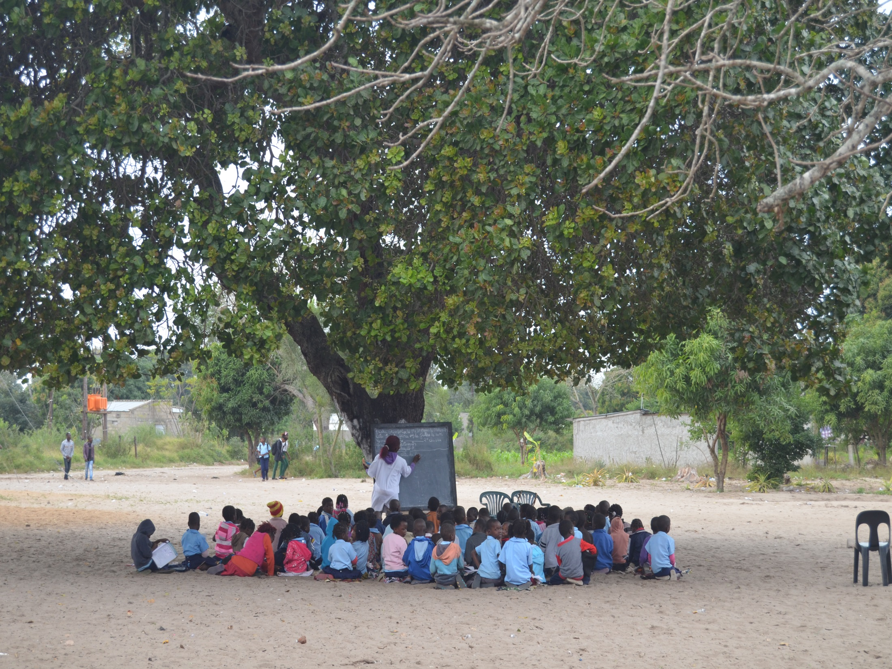
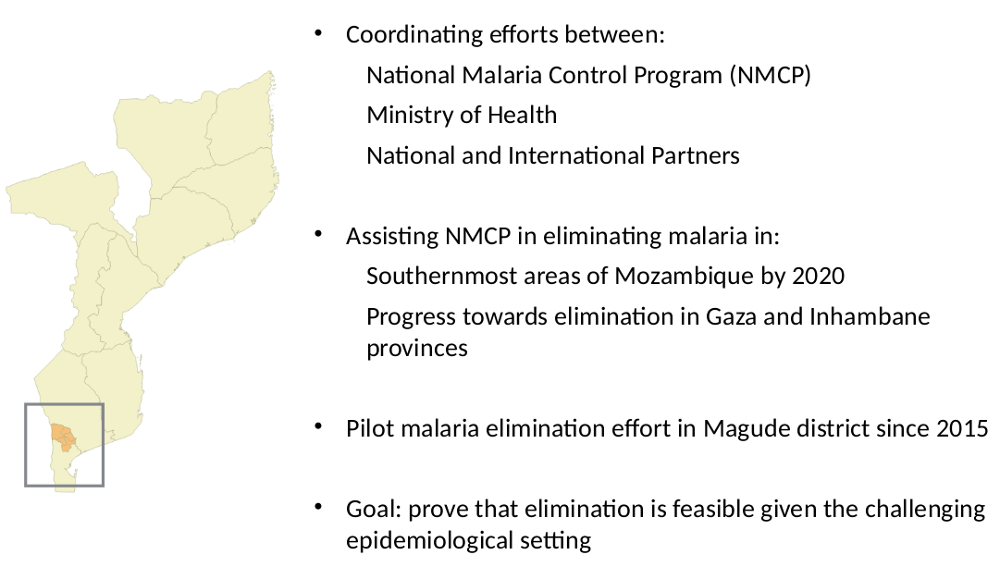
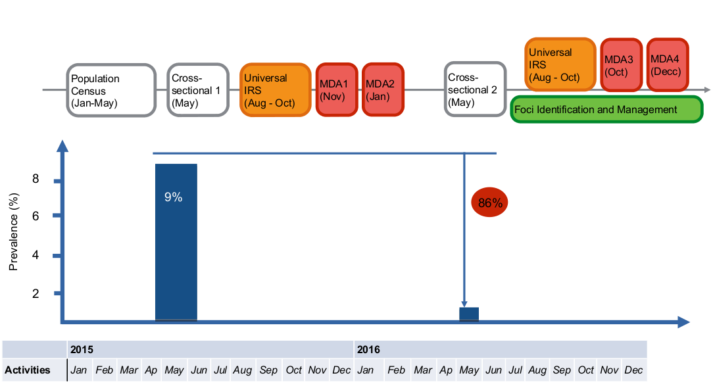
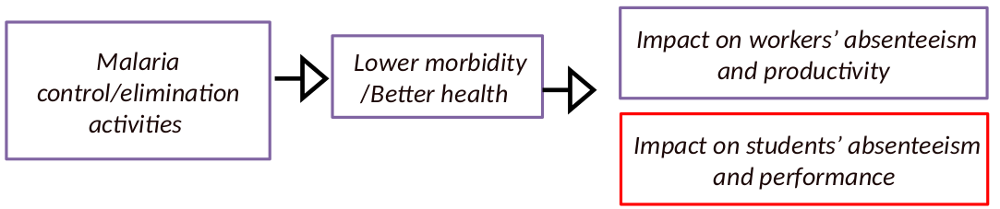
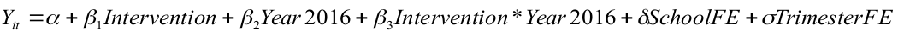
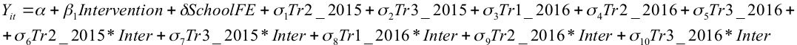
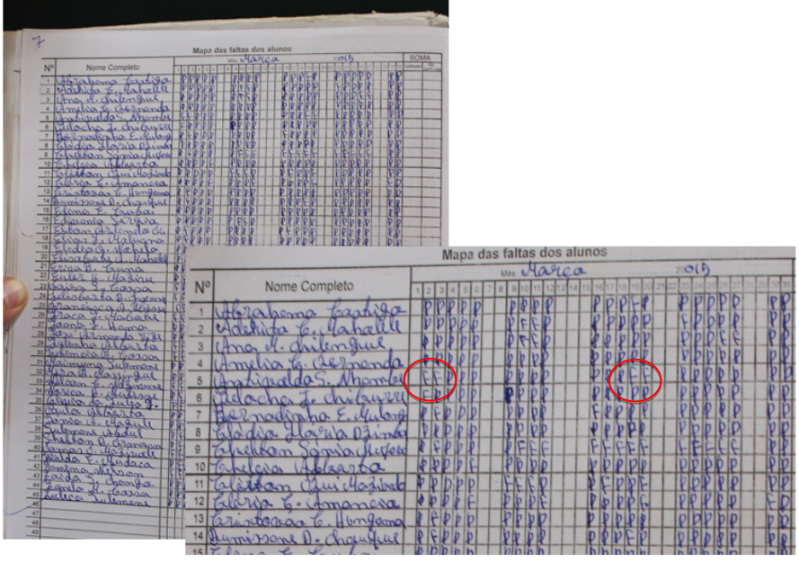

```{r setup, include=FALSE}
knitr::opts_chunk$set(comment = NA, 
               echo = FALSE, 
               warning = FALSE, 
               message = FALSE, 
               error = TRUE, 
               cache = FALSE)
```

```{r, results = 'hide'}
# Packages
library(ggplot2)
library(cism)
library(rgeos)
library(maptools)
library(rgdal)
library(tidyr)
library(RColorBrewer)
library(dplyr)
library(leaflet)
library(readr)
library(ggthemes)
library(ggrepel)
library(knitr)
library(kableExtra)
options(knitr.table.format = "html") 

```


```{r}
source('../prepare_student_data.R', chdir = TRUE)
ab <- ab %>% filter(!grepl('NA', year_term))
performance <- performance %>% filter(!grepl('NA', trimester))
performance$n <- NULL
performance$subject[performance$subject %in% c('English', 'Portuguese')] <- 'Language'

library(RColorBrewer)
# Define some colors
cols <- colorRampPalette(brewer.pal(n = 9,
                                    name = 'BrBG'))(2)
tablify <- function(x, n = 5){
  DT::datatable(x,
                selection = 'none',
                escape = FALSE,
                options = list(#sDom  = '<"top">lrt<"bottom">ip',
                               pageLength = n, 
                               dom = 'tip'))
}
kablify <- function(x, size = 16){
  kable(x) %>% 
  kable_styling(bootstrap_options = c("striped",
  "hover",
  "condensed"),
  font_size = size,
  position = 'float_left')
}
```

## 




## 


## Context

- Mozambique is among the 10 countries with the greatest malaria burden.
- Prevalence as high as 40% in some regions.
- 45% of all outpatient cases.
- 56% of all inpatient cases.
- 26% of all hospital deaths.
- > 100 deaths daily.
- Bordering countries in elimination phase.


## Mozambican Alliance Towards the Elimination of Malaria



## Timeline



## Objectives

1. Impact on malaria incidence (burden)

2. Impact on labour force (absenteeism and productivity)

**3. Impact on school age children (absenteeism and performance)**




## Literature

- Early childhood health shocks -> long-term economic outcomes (Smith 2009, Case et al 2002 & 2005, Currie and Stabile 2003)
- Malaria shown to have lifelong effects on economic outcomes in children - poor cognitive ability, higher absenteeism, poor labour market outcomes (Sachs and Malaney 2002, Lucas 2010)
- Malaria infections among adults (Cutler 2010) shown to lower household income, worsen nutrition and schooling, restrict labour opportunities

## Why is our study interesting?

### We're different

- Previous studies are ecological, retrospective, long-term
- Ours is person-level, real-time, short-term

### Potential impact

- Elimination campaigns: very easy to estimate cost; very hard to estimate benefit
- Short-term trumps the long-term for most policy-makers

## Identification strategy

- We compare grades of students from selected schools in Intervention (Magude
district) and Control (Manhiça district) areas
- For both intervention and control we collected data for the year before the
intervention started (year 2015) and for the year after the intervention started (year
2016).
- We apply difference in difference analysis to identify and measure the short term
impact of the elimination campaign

## Study area

```{r}
cols <- c('darkorange', 'darkgreen')
moz2_fortified <- moz2_fortified
map <- moz2_fortified %>%
  filter(id %in% c('Manhiça',
                   'Magude'))
g <- ggplot() +
  geom_polygon(data = map,
               aes(x = long,
                   y = lat,
                   group = id,
                   fill = id),
               color = 'white',
               # color = 'grey',
               alpha = 0.8) +
  theme_map() +
  scale_fill_manual(name = '',
                    values = cols) +
  # theme_black(base_size = 0) +
  theme(axis.line = element_blank(), axis.text = element_blank(),
        axis.ticks = element_blank(), axis.title = element_blank(),
        legend.position = 'none') +
  theme_cism_map() 
# print(g) +
#     geom_point(data = geo,
#              aes(x = lng,
#                  y = lat),
#              color = 'black',
#              alpha = 0.7,
#              size = 3)
```


```{r}
g +
  geom_point(data = census,
             aes(x = longitude,
                 y = latitude),
             alpha = 0.2,
             col = 'darkred',
             size = 0.1) +
  geom_point(data = geo,
             aes(x = lng,
                 y = lat),
             color = 'black',
             alpha = 0.7,
             size = 3)
```

## Similarity across districts

```{r}
# Make table comparing manhica and magude
x <- students %>%
  left_join(census %>%
              filter(!duplicated(perm_id)))

# Get info on sex, age, etc.
y <- x %>%
  mutate(district = factor(district, levels = c('Manhiça', 'Magude'))) %>%
  group_by(district) %>%
  mutate(age = (as.numeric(as.Date('2016-01-01') - dob)) / 365.25) %>%
  summarise(males = length(which(sex == 'M')),
            females = length(which(sex == 'F')),
            # distance_to_school_mean = mean(km_to_school, na.rm = TRUE),
            # distance_to_school_sd = sd(km_to_school, na.rm = TRUE),
            siblings_mean = mean(n_children_agregado, na.rm = TRUE),
            siblings_sd = sd(n_children_agregado, na.rm = TRUE),
            education_mean = mean(ses_education_household, na.rm = TRUE),
            education_sd = sd(ses_education_household, na.rm = TRUE),
            age_mean = mean(age, na.rm = TRUE),
            age_sd = sd(age, na.rm = TRUE),
            conditions_score_mean = mean(ses_conditions_score, na.rm = TRUE),
            conditions_score_sd = sd(ses_conditions_score, na.rm = TRUE),
            ses_asset_score_mean = mean(ses_asset_score, na.rm = TRUE),
            ses_asset_score_sd = sd(ses_asset_score, na.rm = TRUE),
            identified = length(which(!is.na(district_census))),
            n = n())  %>%
  mutate(p_identified = identified / n * 100)
y <- y %>%
  gather(key, value, males:p_identified) %>%
  mutate(value = round(value, digits = 2)) %>%
  spread(key = district, value = value) %>%
  mutate(key = gsub('sd', 'SD', key)) %>%
  mutate(key = Hmisc::capitalize(gsub('_', ' ', key))) %>%
  rename(Characteristic = key)
y <- y %>% filter(!grepl('Conditions', Characteristic),
                  !grepl('dentified', Characteristic))
kablify(y, size = 14)
```

# Econometric models

## Difference in differences (1)

In diff-diff models: assumption: parallel trends (in the outcome variable) in treatment and
control groups before the introduction of the intervention
In order to check this crucial assumption...




## Event study (2)

The coefficients for the interaction between trimester and intervention area identify the differential trends in the outcome variable over
time between the treated and control regions. Thus, as the policy is implemented in
2016, these coefficients identify any differential pre-trends in the outcome variable
between treated and control regions (the crucial assumption for diff-diff models).



## Data collection

- 4 Schools in Magude (Intervention); 5 Schools in Manhiça (Control)
- Pre-intervention: year 2015
- Post-during intervention: year 2016


## Data collection



## Descriptive statistics

- 9 schools (5 intervention, 4 control)
- 140 classes (across the 2 years observation)
- 8,832 students
- 222,503 observations (on trimester examination)
- 860,927 observations (on daily absenteeism) (unbalanced panel)

```{r}
x <- performance %>%
  group_by(district, year) %>% 
  summarise(val = mean(value)) %>%
  dplyr::select(district, year, val) %>%
    mutate(val = round(val, digits = 2)) %>%
  rename(`Average grade` = val)
y <- ab %>%
  group_by(district, year) %>% 
  summarise(absences = length(which(absent)),
            eligibles = n()) %>%
  ungroup %>%
  mutate(absenteeism_rate = absences / eligibles * 100) %>%
  dplyr::select(district, year, absenteeism_rate) %>%
  mutate(absenteeism_rate = round(absenteeism_rate, digits = 2)) %>%
  rename(`Absenteeism rate` = absenteeism_rate)
x <- left_join(x,y)
x <- gather(x, key, value, `Average grade`: `Absenteeism rate`)
xt <- x %>% spread(key = key, value = value)
names(xt) <- Hmisc::capitalize(names(xt))
tablify(xt)
```

# Absenteeism


## Average absenteeism rate, per term, per school

```{r}
x <- 
  ab %>%
  group_by(year_term, school, district) %>%
  summarise(absences = length(which(absent)),
            presences = length(which(!absent)),
            eligible_days = n(),
            Students = length(unique(name))) %>%
  mutate(absenteeism_rate = absences / eligible_days * 100) %>%
  ungroup %>%
  filter(!grepl('NA', year_term))
y <- x
names(y) <- gsub('_', ' ', names(y))
names(y) <- Hmisc::capitalize(names(y))
# tablify(y)

library(RColorBrewer)
cols <- colorRampPalette(brewer.pal(n = 9, name = 'Set1'))(length(unique(x$school)))
ggplot(data = x,
       aes(x = year_term,
           y = absenteeism_rate,
           group = school,
           color = school)) +
  geom_line(alpha = 0.7,
            size = 2) +
  theme_cism() +
  scale_color_manual(name = 'School',
                     values = cols) +
  ylim(0, 20) +
  theme(axis.text.x = element_text(angle = 90)) +
  labs(x = 'Year-term',
       y = 'Absenteeism rate')
```


## Flat-line vs. decline

```{r}
x <- ab %>%
  group_by(district, year) %>% 
  summarise(absences = length(which(absent)),
            eligibles = n()) %>%
  ungroup %>%
  mutate(absenteeism_rate = absences / eligibles * 100) %>%
  dplyr::select(district, year, absenteeism_rate) %>%
  mutate(absenteeism_rate = round(absenteeism_rate, digits = 2))
# xt <- x %>% spread(key = year, value = absenteeism_rate)
# tablify(xt)
cols <- c('darkorange', 'darkgreen')
ggplot(data = x %>% mutate(year = factor(year)),
       aes(x = year,
           y = absenteeism_rate,
           color = district,
           group = district)) +
  geom_point() +
  geom_line() +
  theme_cism() +
  scale_color_manual(name = '',
                     values = cols) +
  ylim(0, max(x$absenteeism_rate) * 1.05) +
  labs(x = 'Year',
       y = 'Absenteeism rate') +
  geom_label_repel(aes(label = paste0(round(absenteeism_rate, 2), '%')),
                   show.legend = FALSE)
```


# Grades


## Density curves by subject

```{r}
ggplot(data = performance,
       aes(x = value)) +
  facet_wrap(~subject) +
  geom_density(n = 23,
               alpha = 0.6,
               fill = 'darkorange') +
  theme_cism() +
  labs(x = 'Grade (0-20)',
       y = 'Density') +
    theme(strip.background = element_rect(fill=NA),
        strip.text = element_text(color = 'darkgreen', size = 10),
        panel.border = element_blank())
```

## Density cuvres by subject and district

```{r}
ggplot(data = performance,
       aes(x = value,
           group = district,
           fill = district)) +
  facet_wrap(~subject) +
  geom_density(n = 23,
               alpha = 0.4) +
  theme_cism() +
  labs(x = 'Grade (0-20)',
       y = 'Density') +
    theme(strip.background = element_rect(fill=NA),
        strip.text = element_text(color = 'darkgreen', size = 10),
        panel.border = element_blank()) +
  scale_fill_manual(name = 'District',
                    values = c('darkorange', 'darkgreen'))
```


## Density cuvres by subject, year, and district

```{r}
ggplot(data = performance %>%
         mutate(year = factor(year)),
       aes(x = value,
           group = year,
           fill = year)) +
  facet_grid(district~subject) +
  geom_density(n = 23,
               alpha = 0.4,
               color = 'black',
               lwd = 0.5) +
  theme_cism() +
  labs(x = 'Grade (0-20)',
       y = 'Density') +
    theme(strip.background = element_rect(fill=NA),
        strip.text = element_text(color = 'darkgreen', size = 9),
        panel.border = element_blank()) +
  scale_fill_manual(name = 'District',
                    values = c('darkorange', 'darkgreen')) +
  theme(axis.text.x = element_text(angle = 90, size = 6),
        strip.text = element_text(size = 7))
```

## Distribution of grades, all subjects

```{r}
ggplot(data = performance %>% mutate(year = factor(year)),
       aes(x = value)) +
  # geom_histogram(aes(group = year,
  #                    fill = year),
  #                border = NA,
  #                alpha = 0.5,
  #                n = 22) +
  geom_density(aes(group = year,
                   fill = year),
               alpha = 0.5,
               bw = 0.9,
               n = 23) +
  facet_wrap(~district) +
  theme_cism() +
  scale_fill_manual(name = 'Year',
                    values = c('black', 'red')) +
  labs(x = 'Grade (0-20)',
       y = 'Density')
```

## Just maths

```{r}
ggplot(data = performance %>% mutate(year = factor(year)) %>%
         filter(subject == 'Math'),
       aes(x = value)) +
  geom_density(aes(group = year,
                   fill = year),
               alpha = 0.5,
               n = 22) +
  facet_wrap(~district) +
  theme_cism() +
  scale_fill_manual(name = 'Year',
                    values = c('black', 'red')) +
  labs(x = 'Grade (0-20)',
       y = 'Density')
```

## Proportion of those passing exams (grade >= 10/20), all subjects

```{r}
x <- performance %>%
  group_by(district, year) %>% 
  summarise(val = length(which(value >= 10)) / length(value) * 100) %>%
  dplyr::select(district, year, val) %>%
  mutate(val = round(val, digits = 2))
xt <- x %>% spread(key = year, value = val)
# tablify(xt)
```


```{r}
cols <- c('darkorange', 'darkgreen')
ggplot(data = x %>% mutate(year = factor(year)),
       aes(x = year,
           y = val,
           color = district,
           group = district)) +
  geom_point() +
  geom_line() +
  theme_cism() +
  scale_color_manual(name = '',
                     values = cols) +
  # ylim(0, max(x$val) * 1.05) +
  labs(x = 'Year',
       y = 'Percentage passing') +
  geom_label_repel(aes(label = paste0(round(val, 2), '%')),
                   show.legend = FALSE)
```


## Proportion passing exams table (>= 10), trimester level


```{r}
x <- performance %>%
  group_by(district, year = paste0(year, '-', trimester)) %>% 
  summarise(val = length(which(value >= 10)) / length(value) * 100) %>%
  dplyr::select(district, year, val) %>%
  mutate(val = round(val, digits = 2))
xt <- x %>% spread(key = year, value = val)
# tablify(xt)
```

```{r}
cols <- c('darkorange', 'darkgreen')
ggplot(data = x %>% mutate(year = factor(year)),
       aes(x = year,
           y = val,
           color = district,
           group = district)) +
  geom_point(size = 5) +
  geom_line(lty = 3, alpha = 0.5) +
  theme_cism() +
  scale_color_manual(name = '',
                     values = cols) +
  geom_vline(xintercept = 3.5,
             alpha = 0.6,
             color = 'darkred',
             lty = 2) +
  # ylim(0, max(x$val) * 1.05) +
  labs(x = 'Trimester',
       y = 'Percentage passing') #+
  # geom_label_repel(aes(label = paste0(round(val, 1), '%')),
  #                  show.legend = FALSE)
```


## Proportion passing exams table (>= 10), trimester level, math only


```{r}
x <- performance %>%
  filter(subject == 'Math') %>%
  group_by(district, year = paste0(year, '-', trimester)) %>% 
  summarise(val = length(which(value >= 10)) / length(value) * 100) %>%
  dplyr::select(district, year, val) %>%
  mutate(val = round(val, digits = 2))

xt <- x %>% spread(key = year, value = val)
# tablify(xt)
```


```{r}
cols <- c('darkorange', 'darkgreen')
ggplot(data = x %>% mutate(year = factor(year)),
       aes(x = year,
           y = val,
           color = district,
           group = district)) +
    geom_point(size = 5) +
  geom_line(lty = 3, alpha = 0.5) +
  theme_cism() +
  scale_color_manual(name = '',
                     values = cols) +
  geom_vline(xintercept = 3.5,
             alpha = 0.6,
             color = 'darkred',
             lty = 1) +
  # ylim(0, max(x$val) * 1.05) +
  labs(x = 'Trimester',
       y = 'Percentage passing') #+
  # geom_label_repel(aes(label = paste0(round(val, 1), '%')),
  #                  show.legend = FALSE)
```

## Mean grade obtained, all subjects

```{r}
x <- performance %>%
  group_by(district, year) %>% 
  summarise(val = mean(value)) %>%
  dplyr::select(district, year, val) %>%
    mutate(val = round(val, digits = 2))
cols <- c('darkorange', 'darkgreen')
ggplot(data = x %>% mutate(year = factor(year)),
       aes(x = year,
           y = val,
           color = district,
           group = district)) +
  geom_point(size = 4, alpha = 0.7) +
  geom_line(lty = 2,
            alpha = 0.4) +
  theme_cism() +
  scale_color_manual(name = '',
                     values = cols) +
  # ylim(0, max(x$val) * 1.05) +
  labs(x = 'Year',
       y = 'Average grade') +
  geom_label_repel(aes(label = paste0(round(val, 2))),
                   show.legend = FALSE,
                   alpha = 0.5,
                   size = 2) +
  geom_vline(xintercept = 3.5,
             color = 'darkred',
             alpha = 0.6,
             lty = 2,
             size = 1) +
    geom_vline(xintercept = 1.5,
             color = 'darkred',
             alpha = 0.6,
             lty = 2,
             size = 1)
```

## Mean grade obtained, all subjects, by trimester

```{r}
x <- performance %>%
  group_by(district, year = paste0(year, '-', trimester)) %>% 
  summarise(val = mean(value)) %>%
  dplyr::select(district, year, val) %>%
    mutate(val = round(val, digits = 2))

xt <- x %>% spread(key = year, value = val)
# tablify(xt)
```


```{r}
cols <- c('darkorange', 'darkgreen')
ggplot(data = x %>% mutate(year = factor(year)),
       aes(x = year,
           y = val,
           color = district,
           group = district)) +
  
  geom_point(size = 4, alpha = 0.7) +
  geom_line(lty = 2,
            alpha = 0.4) +
  theme_cism() +
  scale_color_manual(name = '',
                     values = cols) +
  # ylim(0, max(x$val) * 1.05) +
  labs(x = 'Trimester',
       y = 'Average grade') +
  geom_label_repel(aes(label = paste0(round(val, 2))),
                   show.legend = FALSE,
                   alpha = 0.5,
                   size = 2) +
  geom_vline(xintercept = 3.5,
             color = 'darkred',
             alpha = 0.6,
             lty = 2,
             size = 1)
```


## Mean grade obtained, math only, by trimester

```{r}
x <- performance %>%
  filter(subject == 'Math') %>%
  group_by(district, year = paste0(year, '-', trimester)) %>% 
  summarise(val = mean(value)) %>%
  dplyr::select(district, year, val) %>%
    mutate(val = round(val, digits = 2))

xt <- x %>% spread(key = year, value = val)
# tablify(xt)
```


```{r}
cols <- c('darkorange', 'darkgreen')
ggplot(data = x %>% mutate(year = factor(year)),
       aes(x = year,
           y = val,
           color = district,
           group = district)) +
  geom_point(size = 4, alpha = 0.7) +
  geom_line(lty = 2,
            alpha = 0.4) +
  theme_cism() +
  scale_color_manual(name = '',
                     values = cols) +
  # ylim(0, max(x$val) * 1.05) +
  labs(x = 'Trimester',
       y = 'Average grade') +
  geom_label_repel(aes(label = paste0(round(val, 2))),
                   show.legend = FALSE,
                   alpha = 0.5,
                   size = 2) +
  geom_vline(xintercept = 3.5,
             color = 'darkred',
             alpha = 0.6,
             lty = 2,
             size = 1)
```

# Regressions

## Passed trimester exam (all subjects)


```{r}

# Passed trimester exam
model_data <- performance %>%
  mutate(pass = ifelse(value >= 10, 1, 0),
         interv = ifelse(district == 'Magude', 'Intervention', 'Control'),
         after = ifelse(year == 2016, 'After', 'Before'),
         interaction = ifelse(year == 2016 & district == 'Magude', 'After:Intervention', '!After:Intervention')) %>%
  mutate(intervention = interv) %>%
  mutate(after = factor(after, levels = c('Before', 'After')))

#### BINOMIAL ANALYSIS -------------------------------------

# Regression number 1
# reg pass intervention after interaction i.school_n, cluster(intervention)
fit1 <- lm(pass ~ after + intervention + interaction + school, data = model_data) # missing the cluster intervention stuff
# summary(fit1)

# Regression number 2
# reg pass intervention after interaction i.school_n i.subject_n if subject_n!=., cluster(intervention)
fit2 <- lm(pass ~ after + intervention + interaction + school + subject, data = model_data %>% filter(!is.na(subject)))
# summary(fit2)

# Regression number 3
# reg pass intervention after interaction i.school_n i.subject_n i.trimester if subject_n!=., cluster(intervention)
fit3 <- lm(pass ~ after + intervention + interaction + school + subject + factor(trimester), data = model_data)
# summary(fit3)

# Regression number 4
# identical to regression number 3 but only for math
x <- model_data %>% filter(subject == 'Math')
fit4 <- lm(pass ~ after + intervention + interaction + school + factor(trimester), data = x)
# summary(fit4)

### CONTINUOUS VARIABLE ANALYSIS --------------------

# Regression number 1
# reg value intervention after interaction i.school_n, cluster(intervention)
fit1b <- lm(value ~ after + intervention + interaction + school, data = model_data) # missing the cluster intervention stuff
# summary(fit1b)

# Regression number 2
# reg value intervention after interaction i.school_n i.subject_n if subject_n!=., cluster(intervention)
fit2b <- lm(value ~ after + intervention + interaction + school + subject, data = model_data %>% filter(!is.na(subject)))
# summary(fit2b)

# Regression number 3
# reg value intervention after interaction i.school_n i.subject_n i.trimester if subject_n!=., cluster(intervention)
fit3b <- lm(value ~ after + intervention + interaction + school + subject + factor(trimester), data = model_data)
# summary(fit3b)

# Regression number 4
# identical to regression number 3 but only for math
x <- model_data %>% filter(subject == 'Math')
fit4b <- lm(value ~ after + intervention + interaction + school + factor(trimester), data = x)
# summary(fit4b)

# Final piece = pass examination
time_df <- data_frame(year = rep(c(2015, 2016), each = 3),
                      trimester = as.character(rep(1:3, 2)),
                      time = -3:2)
model_data <- 
  model_data %>%
  left_join(time_df) %>%
  mutate(intervention = ifelse(intervention == 'Intervention', 1, 0)) %>%
  mutate(timeinterv = time * intervention) %>%
  mutate(timetreat = factor(timeinterv)) %>%
  mutate(period = factor(time)) %>%
  mutate(timetreat = paste0(timetreat, ' Time::Intervention')) %>%
  mutate(period = paste0(period, ' Period'))

# Event study
model_data$timetreat <- factor(model_data$timetreat,
                               levels = c("-3 Time::Intervention",
                                          "-2 Time::Intervention",
                                          "-1 Time::Intervention",
                                          "0 Time::Intervention", 
                                          "1 Time::Intervention", 
                                          "2 Time::Intervention"))
fit5b <- lm(pass ~ intervention + period  + timetreat + school + subject, data = model_data)
# summary(fit5b)

#  Eventy study - Just math
fit6b <- lm(pass ~ intervention + period  + timetreat + school , data = model_data %>% filter(subject == 'Math'))
# summary(fit6b)

# Define function for printing table
pretty_regression <- function(fit = fit1,
                              remove = '!grepl("school", Term) & !grepl("subject", Term) & !grepl("trimester", Term)',
                              label = NULL){
  # Make tidy
  fit_tidy <- broom::tidy(fit)
  # rename some columns
  names(fit_tidy) <- c('Term', 'Estimate', 'S.E.', 'Statistic', 'P')
  fit_tidy$Statistic <- NULL
  # Make long
  fit_tidy <- fit_tidy %>%
    gather(key, value, Estimate:P) %>%
    # mutate(Term = ifelse(Term == '(Intercept)', ' Intercept', Term)) %>%
    arrange(Term)
  # remove stuff
  if(!is.null(remove)){
    fit_tidy <- fit_tidy %>%
      filter_(remove)
  }
  # Recode small vals
  fit_tidy <- 
    fit_tidy %>%
    mutate(value = ifelse(value < 0.001,
                          '< 0.001',
                          as.character(round(value, digits = 3))))
  if(!is.null(label)){
    names(fit_tidy)[3] <- label
  }

  # Remove the variable names
  var_names <- gsub('+', ' ', paste0(as.character(fit$terms[[3]]), collapse = ' + '), fixed = TRUE)
  var_names <- unlist(strsplit(var_names, ' '))
  var_names <- var_names[nchar(var_names) > 0]
  for (i in 1:length(var_names)){
    fit_tidy$Term <- gsub(var_names[i], '', fit_tidy$Term)
  }
  return(fit_tidy)
}
# pretty_regression(fit1)

# Define function for combining pretty regressions
clean_names <- function(df){
  flags <- rep(FALSE, nrow(df))
  for (i in 2:nrow(df)){
    flags[i] <- df$Term[i] == df$Term[i-1]
  }
  df$Term[flags] <- ''
  names(df)[names(df) == 'key'] <- 'Key'
  return(df)
}
x <- pretty_regression(fit1) %>% 
  mutate(regression = 1) %>%
  bind_rows(pretty_regression(fit2) %>%
              mutate(regression = 2)) %>%
  bind_rows(pretty_regression(fit3) %>%
              mutate(regression = 3)) %>%
    mutate(Term = factor(Term,
                       levels = c(sort(unique(Term[Term != '(Intercept)'])), '(Intercept)'))) %>%
  arrange(Term) %>%
  mutate(Term = as.character(Term)) %>%
  # mutate(value = ifelse(is.na(value), '', as.character(value))) %>%
  spread(key = regression,
         value = value,
         fill = '') %>%
  mutate(Term = as.character(Term)) %>%
    clean_names()
# tablify(x, n = nrow(x))
kablify(x, size = 17) %>%
  add_header_above(c(" " = 2, "Regression versions" = 3))

```

All regressions controlling for school. 
Regressions II and III also controlling for subject.

**The impact of the policy is to increase the probability of passing the exam by 2 percentage
points. Given that the proportion of those passing examinations was 87.5% in the
intervention area in 2015, the increase due to the intervention is (0.02/0.875*100) 2.28%.**


## Passed trimester exam (Maths only)

```{r}
kablify(clean_names(pretty_regression(fit4,
                               remove = '!grepl("school", Term)')))
```

The impact of the policy is to increase the
probability of passing the exam by 5
percentage points for the case of maths.
Given that the proportion of those
passing examinations was 76.69% in the
intervention area in 2015, the increase
due to the intervention is
(0.05/0.7669*100) 6.52%.

OLS regression; regression controlling for school (coeff not shown);

## Average grade, all subjects

```{r}
x <- pretty_regression(fit1b) %>% 
  mutate(regression = 1) %>%
  bind_rows(pretty_regression(fit2b) %>%
              mutate(regression = 2)) %>%
  bind_rows(pretty_regression(fit3b) %>%
              mutate(regression = 3)) %>%
    mutate(Term = factor(Term,
                       levels = c(sort(unique(Term[Term != '(Intercept)'])), '(Intercept)'))) %>%
  arrange(Term) %>%
  mutate(Term = as.character(Term)) %>%
  # mutate(value = ifelse(is.na(value), '', as.character(value))) %>%
  spread(key = regression,
         value = value,
         fill = '') %>%
  mutate(Term = as.character(Term)) %>%
    clean_names()
# tablify(x, n = nrow(x))
kablify(x, size = 17) %>%
  add_header_above(c(" " = 2, "Regression versions" = 3))
    # kable_styling(bootstrap_options = c("striped", 
                                        # "hover")) #%>% 
                                        # "condensed", 
                                        # "responsive")) %>%
  # add_header_above(c(" " = 2, "Regression versions" = 3))


```

The impact of the policy is to increase the grade for all subjects by 0.23 percentage
points. Given that the mean grade was 12.11 in the intervention area in 2015, the
increase due to the intervention is (0.22/12.11*100) 1.9%.

## Average grade (Maths only)

```{r}
kablify(clean_names(pretty_regression(fit4b,
                               remove = '!grepl("school", Term)')))
```

# Event study

## Event study model

```{r}
# JOE NEED TO CLEAN THIS UP
x <- clean_names(pretty_regression(fit5b))
x <- x %>% filter(Key == 'Estimate')
kablify(x, size = 20)
```

## Event study model - Maths only

```{r}
# JOE NEED TO CLEAN THIS UP
kablify(clean_names(pretty_regression(fit6b,
                               remove = '!grepl("school", Term)')),
        size = 10)
```

## Event study visualization


```{r}
model_data <- performance %>%
  mutate(pass = ifelse(value >= 10, 1, 0),
         interv = ifelse(district == 'Magude', 'Intervention', 'Control'),
         after = ifelse(year == 2016, 'After', 'Before'),
         interv_after = year == 2016 & district == 'Magude') %>%
  mutate(intervention = interv)


# Final piece = pass examination
time_df <- data_frame(year = rep(c(2015, 2016), each = 3),
                      trimester = as.character(rep(1:3, 2)),
                      time = -3:2)
model_data <- 
  model_data %>%
  left_join(time_df) %>%
  mutate(intervention = ifelse(intervention == 'Intervention', 1, 0)) %>%
  mutate(timeinterv = time * as.numeric(intervention)) %>%
  mutate(timetreat = factor(timeinterv)) %>%
  mutate(period = factor(time))
fit <- lm(pass ~ intervention + period  + timetreat + school + subject, data = model_data)
fit <- broom::tidy(fit)
fit <- fit %>%
  filter(grepl('timetreat', term))
fit$term <- factor(fit$term, 
                   levels = fit$term)

fit <- fit %>% mutate(trimester = 2:6) %>%
  dplyr::select(trimester, estimate)
row1 <- data_frame(trimester = 1,
                   estimate = 0)
fit <- bind_rows(row1, fit)
fit$trimester <- paste0(rep(c(2015, 2016), each = 3),
                        '-',
                        rep(1:3, 2))
fit <- fit %>% filter(trimester != '2015-1')
ggplot(data = fit,
       aes(x = trimester,
           y = estimate,
           group = 1)) +
  geom_line(alpha = 0.2,
            lwd = 1,
            lty = 2,
            color = 'darkgreen') +
  geom_point(alpha = 0.6, size = 4, color = 'darkgreen') +
  geom_vline(xintercept = 2.5,
             color = 'darkred',
             alpha = 0.6,
             lty = 2) +
  theme_cism() +
  labs(x = 'Trimester',
       y = 'Estimate',
       title = 'Place-time interaction',
       subtitle = 'Clear effect of intervention')
```

## Discussion / Conclusion

- Preliminary results point to a positive short term impact of the malaria campaign
on school performance, both in terms of grades as continutous variable and passing
examinations;
- The channel through which the campaign had an impact on school performance is
absenteeism reduction, the next outcome to investigate;
- Next steps:
- controlling for students’ characteristics: sex, socio-economic conditions, etc
- Investigating issues related to the multilevel nature of database
- Investigating issues related to unbalanced panels

## Obrigado!


## A slide on equity

```{r}
x <- performance %>%
  filter(!is.na(census_name)) %>%
  left_join(census %>%
              dplyr::select(census_name, 
                            ses_asset_score,
                            ses_conditions_score,
                            ses_education_household,
                            ses_occupation_household)) %>%
  left_join(students %>%
              dplyr::select(name,
                            in_performance_2015,
                            in_performance_2016)) %>%
  # filter(in_performance_2015, in_performance_2016) %>%
  mutate(ses = ifelse(ses_conditions_score > quantile(ses_conditions_score, 0.75, na.rm = TRUE), 'high', ifelse(ses_conditions_score > quantile(ses_conditions_score, 0.25, na.rm = TRUE), 'medium', ifelse(ses_conditions_score <= quantile(ses_conditions_score, 0.25, na.rm = TRUE), 'low', NA)))) %>%
  filter(!is.na(ses)) %>%
  mutate(ses = factor(ses, levels = c('low', 'medium', 'high'))) %>%
  group_by(ses, district) %>%
  summarise(val_2015 = mean(value[year == 2015], na.rm = TRUE),
            val_2016 = mean(value[year == 2016], na.rm = TRUE)) %>%
  ungroup %>%
  mutate(improvement = val_2016 - val_2015)

g1 <- ggplot(data = x,
       aes(x = district, 
           y = improvement)) +
  geom_bar(stat = 'identity',
           alpha = 0.6,
           fill = 'darkorange',
           color = 'black') +
  facet_wrap(~ses) +
  theme_cism()

# Standardize
rel <- x %>%
  group_by(ses) %>%
  mutate(improvement = improvement / 
           improvement[district == 'Manhiça'])

g2 <- ggplot(data = rel,
       aes(x = district, 
           y = improvement)) +
  geom_bar(stat = 'identity') +
  facet_wrap(~ses) +
  theme_cism()

# Rmisc::multiplot(g1, g2)
g1 +
  labs(x = 'District',
       y = 'Improvement from 2015 to 2016 (0-20)',
       title = 'Non-equitable effect of malaria intervention',
       subtitle = 'Everyone in Magude benefits, but some more than others') +
  geom_label(aes(x = district,
                 y = improvement,
                 label = round(improvement, 2)))
```


## A slide on sex

```{r}
x <- performance %>%
  filter(!is.na(census_name)) %>%
  left_join(census %>%
              dplyr::select(census_name, 
                            sex)) %>%
  left_join(students %>%
              dplyr::select(name,
                            in_performance_2015,
                            in_performance_2016)) %>%
  # filter(in_performance_2015, in_performance_2016) %>%
  filter(!is.na(sex)) %>%
  group_by(sex, district) %>%
  summarise(val_2015 = mean(value[year == 2015], na.rm = TRUE),
            val_2016 = mean(value[year == 2016], na.rm = TRUE)) %>%
  ungroup %>%
  mutate(improvement = val_2016 - val_2015)

g1 <- ggplot(data = x,
       aes(x = sex, 
           y = improvement)) +
  geom_bar(stat = 'identity',
           alpha = 0.6,
           fill = 'darkorange',
           color = 'black') +
  facet_wrap(~district) +
  theme_cism()
g1 +
  labs(x = 'Sex',
       y = 'Improvement from 2015 to 2016 (0-20)',
       title = 'Non-equitable effect of malaria intervention',
       subtitle = 'Everyone in Magude benefits, but some more than others') +
  geom_label(aes(x = sex,
                 y = improvement,
                 label = round(improvement, 2)))
```

## Chickens

```{r}
x <- performance %>%
  filter(!is.na(census_name)) %>%
  left_join(census %>%
              dplyr::select(census_name, 
                            n_chickens)) %>%
  left_join(students %>%
              dplyr::select(name,
                            in_performance_2015,
                            in_performance_2016)) %>%
  filter(!is.na(n_chickens)) %>%
  mutate(n_chickens = ifelse(n_chickens == 0, '00',
                                    ifelse(n_chickens < 20, '01-20',
                                           '21+'))) %>%
  group_by(n_chickens) %>%
  summarise(val_2015 = mean(value[year == 2015], na.rm = TRUE),
            val_2016 = mean(value[year == 2016], na.rm = TRUE)) %>%
  ungroup %>%
  mutate(improvement = val_2016 - val_2015)

ggplot(data = x,
       aes(x = n_chickens,
           y = improvement)) +
  geom_point(alpha = 0.6) +
  theme_cism() +
  geom_line(aes(group = 1),
            alpha = 0.6)

```


# Additional slides

## Contamination effect map


```{r}
cols <- c('darkblue', 'darkgreen')
moz2_fortified <- moz2_fortified
map <- moz2_fortified %>%
  filter(id %in% c('Manhiça',
                   'Magude'))

x <- 
  performance %>%
  filter(year >= 2015) %>%
  group_by(school, year) %>%
  summarise(`Average grade` = round(mean(value), digits = 2)) %>%
  ungroup %>%
  left_join(geo)

ggplot() +
  geom_polygon(data = map,
               aes(x = long,
                   y = lat,
                   group = id),
               color = 'white',
               alpha = 0.8) +
  geom_point(data = x,
             aes(x = lng,
                 y = lat,
                 color = `Average grade`),
             alpha = 0.7,
             size = 5) +
  facet_wrap(~year) +
  theme_cism_map() +
  scale_color_gradient(name = '',
                       low = 'red',
                       high = 'green')
```

## Contamination map 2

Showing the difference between 2015 and 2016 average grades

```{r}
x <- x %>%
  group_by(school) %>%
  summarise(average_grade = `Average grade`[year == 2016] - 
              `Average grade`[year == 2015],
            lng = first(lng),
            lat = first(lat)) %>%
  rename(`Average grade` = average_grade)

ggplot() +
  geom_polygon(data = map,
               aes(x = long,
                   y = lat,
                   group = id),
               color = 'white',
               alpha = 0.8) +
  geom_jitter(data = x,
             aes(x = lng,
                 y = lat,
                 color = `Average grade`),
             alpha = 0.7,
             size = 3) +
  theme_cism_map() +
  scale_color_gradient(name = '',
                       low = 'red',
                       high = 'green') +
  labs(title = 'Improvement from 2015 to 2016',
       subtitle = '0: no improvement; > 0: improvement')
```

## Contamination chart - school performance

```{r}
# Get distance to manhica
x <- geo
x$distance <- NA
x$x <- x$lng; x$y <- x$lat
district_dictionary <- data_frame(school = c('3 DE FEV',
                                               'GRACA MACHEL',
                                               'ILHA JOSINA',
                                               'MAGUDE',
                                               'MAGUIGUANA',
                                               'MARAGRA',
                                               'MOINE',
                                               'SIMBE',
                                               'XINAVANE', # ***
                                               'DUCO'),
                                    district = c('Manhiça',
                                                 'Magude',
                                                 'Manhiça',
                                                 'Magude',
                                                 'Magude',
                                                 'Manhiça',
                                                 'Magude',
                                                 'Magude',
                                                 'Manhiça', # ***
                                                 'Magude'))
x <- x %>%
  left_join(district_dictionary)
mag2 <- cism::mag2
coordinates(x) <- ~x+y
for (i in 1:nrow(x)){
  this_district <- x$district[i]
  if(this_district == 'Magude'){
    x$distance[i] <-
    as.numeric(geosphere::dist2Line(p = x[i,], 
                                          line = man2)[,1]) / 1000
  } else {
    x$distance[i] <-
    as.numeric(geosphere::dist2Line(p = x[i,], 
                                          line = mag2)[,1]) / 1000
  }
  
}
x$distance[x$district == 'Magude'] <- x$distance[x$district == 'Magude'] * -1
x <- x@data

# Get performance by school by year
y <- performance %>%
  group_by(school, year) %>%
  summarise(val = mean(value, na.rm = TRUE),
            n = length(unique(name))) %>%
  group_by(school) %>%
  summarise(dif = val[year == 2016] - val[year == 2015],
            n = first(n))

# Join together
x <- left_join(x, y)

aprop <- performance %>%
            left_join(x) %>%
            filter((distance >= -10 &
                     distance <= 10 &
                   district == 'Manhiça')  |
                     district == 'Magude')
fit <- lm(value ~ district + factor(year) + district*factor(year),
          data = aprop)
summary(fit)

lluny <- performance %>%
            left_join(x) %>%
            filter((distance >= 10 &
                   district == 'Manhiça')  |
                     district == 'Magude')
fit <- lm(value ~ district + factor(year) + district*factor(year),
          data = lluny)
summary(fit)

  # mutate(district= factor(district, levels = c('Manhiça', 'Magude')))
lluny <- performance %>%
            left_join(x) %>%
  mutate(distance = as.numeric(as.character(distance))) %>%
            dplyr::filter(distance <= -10 |
                     distance >= 10) %>%
  mutate(district= factor(district, levels = c('Manhiça', 'Magude')))
fit <- lm(value ~ district + factor(year) + district*factor(year),
          data = lluny)
summary(fit)


ggplot(data = x,
       aes(x = distance,
           y = dif)) +
  geom_point(aes(color = district,
                 size = n), 
             alpha = 0.6) +
  labs(x = 'Kilometers from intervention area',
       y = 'Improvement from 2015 to 2016in averge grade') +
  theme_cism() +
  scale_color_manual(name = 'District',
                     values = c('darkorange', 'darkgreen')) +
  geom_hline(yintercept = 0, lty = 2, alpha = 0.6) +
  geom_vline(xintercept = 0, lty = 2, alpha = 0.6) +
  labs(title = 'Spill-over / contamination?',
       sutitle = 'School performance')
```

## Contamination chart - absenteeism

```{r}
y <- ab %>%
  group_by(year, school) %>%
  summarise(absences = length(which(absent)),
            eligibles = n()) %>%
  ungroup %>%
  mutate(absenteeism_rate = absences / eligibles * 100) %>%
  dplyr::select(school, year, absenteeism_rate) %>%
  group_by(school) %>%
  summarise(ab_dif = absenteeism_rate[year == 2016] - 
             absenteeism_rate[year == 2015])
x <- left_join(x, y)

ggplot(data = x,
       aes(x = distance,
           y = ab_dif)) +
  geom_point(aes(color = district), 
             size = 3,
             alpha = 0.6) +
  labs(x = 'Kilometers from intervention area',
       y = 'Change from 2015 to 2016 in absenteeism') +
  theme_cism() +
  scale_color_manual(name = 'District',
                     values = c('darkorange', 'darkgreen')) +
  geom_hline(yintercept = 0, lty = 2, alpha = 0.6) +
  geom_vline(xintercept = 0, lty = 2, alpha = 0.6) +
  labs(title = 'Spill-over / contamination?',
       sutitle = 'School absenteeism')
```

## Contamination - student-level

```{r}
x <- ab %>%
  left_join(students %>%
              dplyr::select(name, km_to_other_district_student,
                            in_absenteeism_2015,
                            in_absenteeism_2016)) %>%
  filter(in_absenteeism_2015, in_absenteeism_2016) %>%
  group_by(year, name) %>%
  summarise(absences = length(which(absent)),
            eligibles = n()) %>%
  ungroup %>%
  mutate(absenteeism_rate = absences / eligibles * 100) %>%
  group_by(name) %>%
  filter(length(which(year == 2015)) == 1,
         length(which(year == 2016)) == 1) %>%
  summarise(ab_dif = absenteeism_rate[year == 2016] - 
             absenteeism_rate[year == 2015])
x <- students %>%
  dplyr::select(name,
                district,
                km_to_other_district_student) %>%
  left_join(x)
x$km_to_other_district_student[x$district == 'Magude'] <-
  x$km_to_other_district_student[x$district == 'Magude'] * -1

ggplot(data = x,
       aes(x = km_to_other_district_student,
           y = ab_dif)) +
  geom_point(aes(color = district), 
             size = 1,
             alpha = 0.6) +
  labs(x = 'Kilometers from intervention area',
       y = 'Change from 2015 to 2016 in absenteeism') +
  theme_cism() +
  scale_color_manual(name = 'District',
                     values = c('darkorange', 'darkgreen')) +
  geom_hline(yintercept = 0, lty = 2, alpha = 0.6) +
  geom_vline(xintercept = 0, lty = 2, alpha = 0.6) +
  labs(title = 'Spill-over / contamination?',
       sutitle = 'School absenteeism') 
```


## Descriptive statistics on performance

- `r length(unique(performance$school))` schools
- `r length(unique(performance$name))` students
- `r nrow(performance)` observations (subject-specific trimester exams)
- Unbalanced panel

```{r}
x <-
  performance %>%
  group_by(district,year) %>%
  summarise(average_grade = round(mean(value), digits = 2),
            sd_grade = round(sd(value), digits = 2))
tablify(x)
```


## Number of unique students, per year in performance

```{r}
x <- performance %>%
  group_by(year, name) %>%
  tally %>%
  ungroup %>%
  dplyr::select(-n) %>%
  filter(year >= 2015) %>%
  group_by(year) %>%
  tally 
names(x) <- c('Year', 'Students')
tablify(x)
```


## Number of unique students, per year, per district

```{r}
x <- performance %>%
  group_by(year, district, name) %>%
  tally %>%
  ungroup %>%
  dplyr::select(-n) %>%
  filter(year >= 2015) %>%
  group_by(year, district) %>%
  tally 
names(x) <- c('Year', 'District', 'Students')
tablify(x)
```


## Number of students followed through both years

```{r}
x <- performance %>%
  group_by(name, year) %>%
  tally %>%
  ungroup 
starters <- length(unique(x$name[x$year == 2015]))
finishers <- x %>%
  group_by(name) %>%
  filter(length(year) > 1) %>%
  dplyr::select(-n) %>%
  tally
finishers <- nrow(finishers)
```

`r finishers` of `r starters` (`r round(finishers / starters * 100, digits = 2)`%)

## Average number of observations, per student, per year

(One observation = 1 trimester-class)

```{r}
x <- 
  performance %>%
  group_by(name, year) %>%
  tally %>%
  ungroup %>%
  filter(year >= 2015) %>%
  group_by(year) %>%
  summarise(`Average Observations` = round(mean(n, digits = 2)))
tablify(x)
```

## Total number of observations, per year	

(One observation = 1 trimester-class)

```{r}
x <- 
  performance %>%
  group_by(name, year) %>%
  tally %>%
  ungroup %>%
  filter(year >= 2015) %>%
  group_by(year) %>%
  summarise(`Total Observations` = sum(n))
tablify(x)
```

## Average yearly grade, per school and year

```{r}
x <- 
  performance %>%
  filter(year >= 2015) %>%
  group_by(school, year) %>%
  summarise(`Average grade` = round(mean(value), digits = 2)) %>%
  ungroup %>%
  spread(key = year,
         value = `Average grade`)
tablify(x)
```
	

# Absenteeism


## Number of unique students, per year

```{r}
x <- ab %>%
  group_by(year, name) %>%
  tally %>%
  ungroup %>%
  dplyr::select(-n) %>%
  filter(year >= 2015) %>%
  group_by(year) %>%
  tally 
names(x) <- c('Year', 'Students')
tablify(x)
```


## Number of unique students, per year, per district

```{r}
x <- ab %>%
  group_by(year, district, name) %>%
  tally %>%
  ungroup %>%
  dplyr::select(-n) %>%
  filter(year >= 2015) %>%
  group_by(year, district) %>%
  tally 
names(x) <- c('Year', 'District', 'Students')
tablify(x)
```


## Number of students followed through both years

```{r}
x <- ab %>%
  group_by(name, year) %>%
  tally %>%
  ungroup 
starters <- length(unique(x$name[x$year == 2015]))
finishers <- x %>%
  group_by(name) %>%
  filter(length(year) > 1) %>%
  dplyr::select(-n) %>%
  tally
finishers <- nrow(finishers)
```

`r finishers` of `r starters` (`r round(finishers / starters * 100, digits = 2)`%)

## Average number of observations, per student, per year

(One observation = 1 student-day)

```{r}
x <- 
  ab %>%
  group_by(name, year) %>%
  tally %>%
  ungroup %>%
  filter(year >= 2015) %>%
  group_by(year) %>%
  summarise(`Average Observations` = round(mean(n, digits = 2)))
tablify(x)
```

## Total number of observations, per year	

(One observation = 1 student-day)

```{r}
x <- 
  ab %>%
  group_by(name, year) %>%
  tally %>%
  ungroup %>%
  filter(year >= 2015) %>%
  group_by(year) %>%
  summarise(`Total Observations` = sum(n))
tablify(x)
```

# Combined

## Number of students that we have both info on absenteeism and performance

```{r}
x <- 
  ab %>%
  group_by(name, year) %>%
  tally %>%
  ungroup %>%
  filter(year >= 2015) %>% 
  mutate(src = 'ab') %>%
  bind_rows(
    performance %>%
  group_by(name, year) %>%
  tally %>%
  ungroup %>%
  filter(year >= 2015) %>%
    mutate(src = 'perf')
  ) %>%
  group_by(year, name, src) %>%
  summarise(n = sum(n)) %>%
  ungroup %>%
  arrange(name, year) %>%
  group_by(year, name) %>%
  summarise(have_ab = sum(n[src == 'ab'] > 0),
            have_perf = sum(n[src == 'perf'] > 0)) %>%
  mutate(have_both = have_ab == 1 & have_perf == 1) %>%
  group_by(year) %>%
  summarise(`Students in absenteeism` = sum(have_ab),
            `Students in performance` = sum(have_perf),
            `Students in both` = sum(have_both)) 
tablify(x)
```

## Total magnitude of database

- `r nrow(ab)` student-days observed (absenteeism)  

- `r nrow(performance)` student-class-trimesters observed (performance)


## Average absenteeism rate, per term, per district

```{r}
x <- 
  ab %>%
  group_by(year_term, district) %>%
  summarise(absences = length(which(absent)),
            presences = length(which(!absent)),
            eligible_days = n(),
            Students = length(unique(name))) %>%
  mutate(absenteeism_rate = absences / eligible_days * 100) %>%
  ungroup %>%
  filter(!grepl('NA', year_term))
y <- x
names(y) <- gsub('_', ' ', names(y))
names(y) <- Hmisc::capitalize(names(y))
# tablify(y)
library(RColorBrewer)
cols <- colorRampPalette(brewer.pal(n = 9, name = 'Set1'))(length(unique(x$district)))
ggplot(data = x,
       aes(x = year_term,
           y = absenteeism_rate,
           group = district,
           color = district)) +
  geom_line(alpha = 0.7,
            size = 2) +
  theme_cism() +
  scale_color_manual(name = 'District',
                     values = cols) +
  ylim(0, 10) +
  theme(axis.text.x = element_text(angle = 90)) +
  labs(x = 'Year-term',
       y = 'Absenteeism rate')

```

# Additional charts

## Sex

```{r}
# Sex and absenteeism
x <- ab %>%
  left_join(census %>%
              dplyr::select(census_name, sex)) %>%
  group_by(sex) %>%
  summarise(absences = length(which(absent)),
            eligibles = n()) %>%
  ungroup %>%
  mutate(absenteeism_rate = absences / eligibles * 100) %>%
  filter(!is.na(sex))

ggplot(data = x,
       aes(x = sex,
           y = absenteeism_rate)) +
  geom_bar(stat = 'identity',
           fill = 'darkgreen',
           alpha = 0.6) +
  theme_cism() +
  labs(x = 'Sex',
       y = 'Absenteeism rate',
       title = 'Absenteeism rate by sex')
```


## Sex and absetneeism over time

```{r}
x <- ab %>%
  left_join(census %>%
              dplyr::select(census_name, sex)) %>%
  mutate(year_month = date_truncate(date, 'month')) %>%
  group_by(sex, year_month, district) %>%
  summarise(absences = length(which(absent)),
            eligibles = n()) %>%
  ungroup %>%
  mutate(absenteeism_rate = absences / eligibles * 100) %>%
  filter(!is.na(sex))

ggplot(data = x,
       aes(x = year_month,
           y = absenteeism_rate,
           color = district)) +
  geom_line() + 
  facet_wrap(~sex, ncol = 1) +
  scale_color_manual(name = 'District',
                     values = cols) +
  theme_cism() +
  labs(x = 'Month',
       y = 'Absenteeism rate',
       title = 'Absenteeism rate by sex')
```

## Distance to school

```{r}

# DISTANCE TO SCHOOL AND ABSENTEEISM
x <- 
  ab %>%
  group_by(census_name) %>%
  summarise(absences = length(which(absent)),
            eligibles = n()) %>%
  ungroup %>%
  mutate(absenteeism_rate = absences / eligibles * 100) %>%
  left_join(students %>%
              dplyr::select(census_name,
                            km_to_health_facility,
                            km_to_school,
                            km_to_other_district_student)) %>%
  filter(!is.na(km_to_school)) %>%
  mutate(distance_to_school = 
           ifelse(km_to_school < 5, '0-5', '5+'))

ggplot(data = x,
       aes(x = km_to_school,
           y = absenteeism_rate)) +
  geom_jitter(alpha = 0.2, color = 'darkorange') +
  scale_x_log10() +
  scale_y_log10() +
  labs(x = 'Kilometers to school',
       y = 'Absenteeism rate',
       title = 'Absenteeism and distance to school',
       subtitle = 'Closer = better') +
  theme_cism() +
  geom_smooth()
```

## Distance to school

```{r}
ggplot(data = x,
       aes(x = km_to_school,
           y = absenteeism_rate)) +
  geom_jitter(alpha = 0.2, color = 'darkorange') +
  # scale_x_log10() +
  # scale_y_log10() +
  labs(x = 'Kilometers to school',
       y = 'Absenteeism rate',
       title = 'Absenteeism and distance to school',
       subtitle = 'Closer = better') +
  theme_cism() +
  geom_smooth()
```

## Distance to school

```{r}

ggplot(data = x,
       aes(x = km_to_school,
           y = absenteeism_rate)) +
  geom_jitter(alpha = 0.2, color = 'darkorange') +
  scale_x_log10() +
  scale_y_log10() +
  labs(x = 'Kilometers to school',
       y = 'Absenteeism rate',
       title = 'Absenteeism and distance to school',
       subtitle = 'Closer = better') +
  theme_cism() +
  geom_smooth() +
  facet_wrap(~distance_to_school,
             ncol = 1,
             scales = 'free_x')

```

## Number of siblings

```{r}

# Number of siblings and absetneeism rate

x <- ab %>%
  group_by(census_name) %>%
  summarise(absences = length(which(absent)),
            eligibles = n()) %>%
  ungroup %>%
  mutate(absenteeism_rate = absences / eligibles * 100) %>%
  left_join(census %>%
              dplyr::select(census_name, n_children_agregado)) %>%
  mutate(siblings = ifelse(n_children_agregado == 1, '0',
                           ifelse(n_children_agregado <=3, '1-2',
                                  ifelse(n_children_agregado <=6, '3-5',
                                         ifelse(n_children_agregado >=5, '6+', NA))))) %>%
  filter(!is.na(siblings)) %>%
  mutate(n_children = ifelse(siblings <= 2, '1-3',
                                    '4+'))

avg <- x %>%
  group_by(siblings) %>%
  summarise(absenteeism_rate = mean(absenteeism_rate))

ggplot(data = x,
       aes(x = siblings,
           y = absenteeism_rate)) +
  geom_jitter(alpha = 0.6,
              color = 'darkgreen') +
  geom_violin(alpha = 0.3) +
  geom_point(data = avg,
           aes(x = siblings, 
               y = absenteeism_rate),
           color = 'red',
           size = 40,
           pch = '-') +
  scale_y_log10() +
  theme_cism() +
  labs(x = 'Siblings',
       y = 'Absenteeism rate',
       title = 'Absenteeism rate by siblings',
       subtitle = 'No clear relationship')
```

## Number of siblings

```{r}


x <- ab %>%
  group_by(census_name, year_term, district) %>%
  summarise(absences = length(which(absent)),
            eligibles = n()) %>%
  ungroup %>%
  mutate(absenteeism_rate = absences / eligibles * 100) %>%
  left_join(census %>%
              dplyr::select(census_name, n_children_agregado)) %>%
  mutate(siblings = ifelse(n_children_agregado == 1, '0',
                           ifelse(n_children_agregado <=3, '1-2',
                                  ifelse(n_children_agregado <=6, '3-5',
                                         ifelse(n_children_agregado >=5, '6+', NA))))) %>%
  filter(!is.na(siblings)) %>%
  mutate(n_children = ifelse(siblings <= 2, '1-3',
                                    '4+')) %>%
  group_by(district, year_term, n_children) %>%
  summarise(absenteeism_rate = mean(absenteeism_rate)) %>%
  filter(!grepl('NA', year_term))

ggplot(data = x,
       aes(x = year_term,
           y = absenteeism_rate,
           color = district,
           group = district)) +
  geom_line() + 
  facet_wrap(~n_children, ncol = 1) +
  labs(x = 'Year/term',
       y = 'Absenteeism rate',
       title = 'Effect of family size',
       subtitle = 'Absenteeism rate by number of children in agregado') +
  theme_cism() +
  scale_color_manual(name = 'District',
                     values = cols) +
  theme(axis.text.x = element_text(angle = 90))
```

## Education

```{r}
x <- ab %>%
  left_join(census %>%
              dplyr::select(census_name, ses_education_household))  %>%
  group_by(year_term, census_name, district) %>%
  summarise(absences = length(which(absent)),
            eligibles = n(),
            ses_education_household = first(ses_education_household)) %>%
  ungroup %>%
  mutate(absenteeism_rate = absences / eligibles * 100) %>%
  filter(!is.na(ses_education_household)) %>%
  filter(!grepl('NA', year_term)) %>%
  mutate(education = ifelse(ses_education_household <2, 
                            'Low',
                            ifelse(ses_education_household <4,
                                   'Medium', 
                                   ifelse(ses_education_household >= 4, 'High', NA)))) %>%
  mutate(education = factor(education,
                            levels = c('Low', 'Medium', 'High')))
         

ggplot(data = x,
       aes(x = ses_education_household,
           y = absenteeism_rate)) +
  geom_jitter(width = 1,
              alpha = 0.3,
              color = 'darkgreen') +
  geom_smooth() +
  theme_cism() +
  labs(x = 'Household education level',
       y = 'Absenteeism rate',
       title = 'Education and absenteeism',
       subtitle = 'No clear relationship')

```

## Education and absenteeism

```{r}
ggplot(data = x,
       aes(x = education,
           y = absenteeism_rate)) +
  geom_jitter(#width = 1,
              alpha = 0.3,
              color = 'darkgreen') +
  geom_violin() +
  theme_cism() +
  labs(x = 'Household education level',
       y = 'Absenteeism rate',
       title = 'Education and absenteeism')
```

## Education and absenteeism

```{r}


ggplot(data = x,
       aes(x = absenteeism_rate,
           group = education,
           fill = education)) +
  geom_density(alpha = 0.8, n = 15) +
  scale_x_log10() +
  labs(x = 'Absenteeism rate',
       y = 'Density',
       title = 'Family education and absenteeism') +
  scale_fill_manual(name = 'Education',
                    values = brewer.pal(3, 'Spectral')) +
  theme_cism()
```

## Education and absenteeism over time

```{r}
# Over time
x <- x %>%
  group_by(year_term,
           education, district) %>%
  summarise(absenteeism_rate = sum(absences) / sum(eligibles) * 100) %>%
  ungroup
ggplot(data = x,
       aes(x = year_term,
           y = absenteeism_rate,
           group = district,
           color = district)) +
  geom_line() +
  geom_point() +
  facet_wrap(~education, ncol = 3) +
  theme_cism() +
  labs(x = 'Term',
       y = 'Absenteeism rate',
       title = 'Effect of Education level') +
  scale_color_manual(name = 'District',
                     values = cols) +
  theme(axis.text.x = element_text(angle = 90))
```


## SES Assets

```{r}
x <- ab %>%
  left_join(census %>%
              dplyr::select(census_name, ses_asset_score,
                            ses_conditions_score))  %>%
  group_by(year_term, census_name, district) %>%
  summarise(absences = length(which(absent)),
            eligibles = n(),
            ses_asset_score = first(ses_asset_score),
            ses_conditions_score = first(ses_conditions_score)) %>%
  ungroup %>%
  mutate(absenteeism_rate = absences / eligibles * 100) %>%
  # filter(!is.na(ses_education_household)) %>%
  filter(!grepl('NA', year_term)) %>%
  mutate(conditions = ifelse(ses_conditions_score <= 10000, 
                             'Low',
                             ifelse(ses_conditions_score <= 2000,
                                    'Medium',
                                    ifelse(ses_conditions_score > 20000,
                                           'High', NA)))) %>%
  mutate(assets = ifelse(ses_asset_score <= 6780, 
                         'Low',
                         ifelse(ses_asset_score > 6780,
                                'High', 
                                NA))) %>%
  filter(!is.na(assets),
         !is.na(conditions))


ggplot(data = x,
       aes(x = assets,
           y = absenteeism_rate)) +
  geom_jitter(color = 'darkgreen', alpha = 0.6) +
  geom_violin(alpha = 0.3) +
  scale_y_log10() +
  labs(x = 'Assets',
       y = 'Absenteeism rate',
       title = 'Assets and absenteeism',
       subtitle = 'No finding') +
  theme_cism()
```

## Assets

```{r}

y <- x %>%
  group_by(year_term,
           district,
           assets) %>%
  summarise(absenteeism_rate = sum(absences) / sum(eligibles) * 100)

ggplot(data = y,
       aes(x = year_term,
           y = absenteeism_rate,
           color = district,
           group = district)) +
  geom_line() +
  facet_wrap(~assets, ncol = 1) +
  # geom_smooth() +
  theme_cism() +
  labs(x = 'Term',
       y = 'Absenteeism rate',
       title = 'Assets score and absenteeism') +
  scale_color_manual(name = 'District',
                     values = cols) +
  theme(axis.text.x = element_text(angle = 90))
```

## Assets

```{r}

ggplot(data = x,
       aes(x = conditions,
           y = absenteeism_rate)) +
  geom_jitter(color = 'darkgreen', alpha = 0.6) +
  geom_violin(alpha = 0.3) +
  scale_y_log10() +
  labs(x = 'Conditions score',
       y = 'Absenteeism rate',
       title = 'Conditions and absenteeism',
       subtitle = 'No finding') +
  theme_cism()
```

## Assets


```{r}
ggplot(data = x,
       aes(x = assets,
           y = absenteeism_rate)) +
  geom_jitter(color = 'darkgreen', alpha = 0.6) +
  geom_violin(alpha = 0.3) +
  scale_y_log10() +
  labs(x = 'Assets',
       y = 'Absenteeism rate',
       title = 'Assets and absenteeism',
       subtitle = 'No finding') +
  theme_cism()
```

## Conditions

```{r}

y <- x %>%
  group_by(year_term,
           district,
           conditions) %>%
  summarise(absenteeism_rate = sum(absences) / sum(eligibles) * 100)

ggplot(data = y,
       aes(x = year_term,
           y = absenteeism_rate,
           color = district,
           group = district)) +
  geom_line() +
  facet_wrap(~conditions, ncol = 1) +
  # geom_smooth() +
  theme_cism() +
  labs(x = 'Term',
       y = 'Absenteeism rate',
       title = 'Conditions score and absenteeism') +
  scale_color_manual(name = 'District',
                     values = cols) +
  theme(axis.text.x = element_text(angle = 90))
```

## Performance over time

```{r}

# See how performance changed over time
x <- performance %>% 
  group_by(district,year, trimester) %>% 
  summarise(average=mean(value, na.rm=TRUE),
            students = length(unique(`Study Subject ID`))) %>%
  mutate(year_trimester = paste0(year, '-', trimester)) %>%
  filter(!is.na(year))
#
ggplot(data = x,
       aes(x = year_trimester,
           y = average,
           group = district,
           color = district)) +
  geom_point(aes(size = students)) +
  geom_line()
```

## Performance over time

```{r}

# See how performance changed over year
x <- performance %>% 
  group_by(district,year) %>% 
  summarise(average=mean(value, na.rm=TRUE),
            students = length(unique(`Study Subject ID`))) %>%
  filter(!is.na(year))
#
ggplot(data = x,
       aes(x = year,
           y = average,
           group = district,
           color = district)) +
  geom_point(aes(size = students)) +
  geom_line()
```


## Performance over time

```{r}

# See how performance changed over time by school
x <- performance %>% 
  group_by(district, school,year, trimester) %>% 
  summarise(average=mean(value, na.rm=TRUE),
            students = length(unique(`Study Subject ID`))) %>%
  mutate(year_trimester = paste0(year, '-', trimester)) %>%
  filter(!is.na(year))
#
library(RColorBrewer)
cols <- colorRampPalette(brewer.pal(9, 'Spectral'))(length(unique(x$school)))
ggplot(data = x,
       aes(x = year_trimester,
           y = average,
           group = school,
           color = school)) +
  geom_point(aes(size = students,
                 pch = district),
             alpha = 0.8) +
  geom_line() +
  scale_color_manual(name = 'School',
                     values = cols) +
  theme_bw()
```


## Performance over time

```{r}


# Distribution of performance by year and district
ggplot(data = performance,
       aes(x = value)) +
  geom_histogram(alpha = 0.5) +
  facet_wrap(~year, ncol = 1)

```


## Performance over time

```{r}

ggplot(data = performance,
       aes(x = value)) +
  geom_histogram(alpha = 0.5) +
  facet_grid(year~district)

```


## Performance over time

```{r}

ggplot(data = performance %>%
         mutate(year = factor(year)),
       aes(x = value,
           group = year,
           fill = year)) +
  geom_density(alpha = 0.5,
               color = NA) +
  facet_wrap(~school)

```


## Performance over time

```{r}

ggplot(data = performance %>%
         mutate(year = factor(year)),
       aes(x = year,
           y = value)) +
  # geom_point(alpha = 0.6) +
  geom_violin(alpha = 0.3, 
              fill = 'darkorange') +
  facet_wrap(~school)

```

# Other indictors

## Monthly absenteeism by district

```{r}
monthly_by_district <-
  ab %>%
  group_by(district, month) %>%
  summarise(absences = length(which(absent)),
            presences = length(which(!absent)),
            eligible_days = n()) %>%
  mutate(absenteeism_rate = absences / eligible_days * 100) %>%
  ungroup

ggplot(data = monthly_by_district,
       aes(x = month,
           y = absenteeism_rate,
           group = district,
           color = district)) +
  geom_line(alpha = 0.8,
            size = 2) +
  theme_cism() +
  labs(x = 'Date',
       y = 'Absenteeism rate',
       title = 'Montly absenteeism rate',
       subtitle = 'One district = one line') +
  scale_color_manual(name = 'District',
                     values = cols)
```

## Absenteeism by term and district

```{r}
# year term by district
year_term_by_district <-
  ab %>%
  group_by(year_term, district) %>%
  summarise(absences = length(which(absent)),
            presences = length(which(!absent)),
            eligible_days = n()) %>%
  mutate(absenteeism_rate = absences / eligible_days * 100) %>%
  ungroup %>%
  filter(!is.na(year_term)) %>%
  filter(!grepl('NA', year_term))

ggplot(data = year_term_by_district,
       aes(x = year_term,
           y = absenteeism_rate,
           group = district,
           color = district)) +
  geom_line(alpha = 0.8,
            size = 2) +
  theme_cism() +
  labs(x = 'Year - term',
       y = 'Absenteeism rate',
       title = 'Montly absenteeism rate',
       subtitle = 'One district = one line') +
  scale_color_manual(name = 'District',
                     values = cols)

```

## Absenteeism by year and district

```{r}
year_by_district <-
  ab %>%
  group_by(year, district) %>%
  summarise(absences = length(which(absent)),
            presences = length(which(!absent)),
            eligible_days = n()) %>%
  mutate(absenteeism_rate = absences / eligible_days * 100) %>%
  ungroup

library(ggrepel)
ggplot(data = year_by_district,
       aes(x = factor(year),
           y = absenteeism_rate,
           group = district,
           color = district)) +
  geom_line(alpha = 0.8,
            size = 2) +
  geom_point(size = 5) +
  theme_cism() +
  labs(x = 'Year - term',
       y = 'Absenteeism rate',
       title = 'Montly absenteeism rate',
       subtitle = 'One district = one line') +
  scale_color_manual(name = 'District',
                     values = cols) +
  geom_hline(yintercept = year_by_district %>%
               filter(year == min(year)) %>%
               .$absenteeism_rate,
             lty = 2,
             alpha = 0.6) +
  geom_text_repel(aes(label = paste0(round(absenteeism_rate, digits = 2), '%')),
                  point.padding = unit(1, "lines")) +
  ylim(0, 8)
```

## Standardized absenteeism


```{r}

# Standardized
year_by_district <-
  year_by_district %>%
  arrange(year) %>%
  group_by(district) %>%
  mutate(p = absenteeism_rate / first(absenteeism_rate) * 100)

ggplot(data = year_by_district,
       aes(x = factor(year),
           y = p,
           group = district,
           color = district)) +
  geom_line(alpha = 0.8,
            size = 2) +
  geom_point(size = 5) +
  theme_cism() +
  labs(x = 'Year - term',
       y = 'Absenteeism rate',
       title = 'Montly absenteeism rate',
       subtitle = 'One district = one line') +
  scale_color_manual(name = 'District',
                     values = cols) +
  geom_hline(yintercept = 100,
             lty = 2,
             alpha = 0.6) +
  geom_text_repel(aes(label = paste0(round(p, digits = 2), '%')),
                  point.padding = unit(1, "lines"))

```
